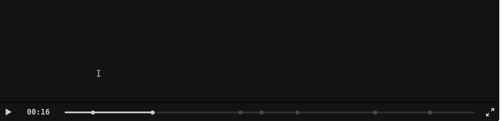

# Cinelog
Comprehensive logging of all terminal input and output for each session based on Asciinema and wild zsh + Python scripting.

This tool is a strong modification of my former logging project https://github.com/cmprmsd/cLoggy with many features removed in order to focus on and extend the core features.

## Introduction

Each terminal in the context of root will create a `.cast` file and a `.commands.log` file. 

For each sudo user a directory will be created:

Each excecuted command will be logged and written to the commands.log file with the current timestamp of execution. All raw input and output will be streamed to the .cast file which contains escape sequences for every change in the terminal.

## Search
The main feature of this plugin is the log organization, search and web player.

The search functionality can be used with `hist` e.g. `hist <term>` and hist `<terms with spaces>`.

This will search the executed commands but not the output.
It will output a dropdown selection menu that you can navigate with keyboard or mouse(wheel). 

In order to search through both the executed commands and the terminal output you may specify `-a` as first argument.

You'll differentiate commands from output by the filename of each match.

Once you press `enter` on a selection, the link to the `Cinelog Viewer` will be printed to the terminal.

## Cinelog Viewer
This feature is a simple webserver. Your selected cast will be viewed in this web player.

I applied some magic to summon the ingestion of `chapter markers` to the video timeline for each executed command. That way, you can easily navigate between commands via `[` and `]`.

## Installation

1. Download and install zsh zim framework: `curl -fsSL https://raw.githubusercontent.com/zimfw/install/master/install.zsh | zsh`
2. Remove `compinit` from your .zshrc if needed
3. Install asciinema `apt install asciinema`
4. Edit .zimrc and add `zmodule cmprmsd/cinelog`
5. Run `zimfw install` to download the plugin from GitHub
6. Start a new terminal
7. Verify installation with `logs tree` and verify if the `hist` command is available
8. Check if the Python webserver is running on port 10000
9. For future updates `zimfw update` should suffice

## Extras

### Per Folder Logs
By default for each cwd a history file will be created in `~/.zsh_history.d/`. Using the alias `here` the executed commands in this directory will be printed, which is helpful for less often used git repositories you don't know how you got working.

### Message of the day
The terminal will by default output some information about the current networking stack, disk space and the log destination.

### Customization
You can opt-out of several extra features by changing your config file in `.config/cinelog/cinelog-settings.conf`.

## Credits
Thanks to 
Marcin [ku1ik](https://github.com/ku1ik) for his awesome [asciinema suite](https://github.com/asciinema/)!